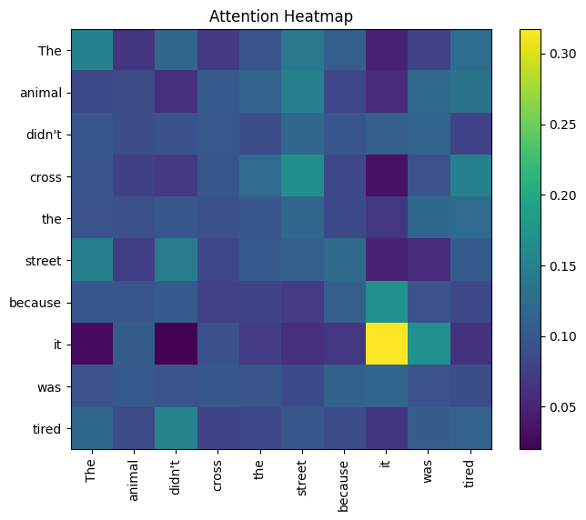

# Attention Heatmap Explorer


# Attention Heatmap Explorer

## Overview
This project demonstrates the **Self-Attention Mechanism** from Transformers.
It visualizes how words in a sentence attend to each other using PyTorch.


## Folder Structure
```
attention-heatmap-explorer/
│
├── Attention_Heatmap_Explorer.ipynb   # Main notebook with code + explanations
├── README.md                          # Project overview + instructions + screenshot
├── requirements.txt                   # Dependencies (torch, matplotlib, notebook)
├── images/
│   └── attention_heatmap.png          # Exported heatmap visualization
└── .gitignore                         # Ignore cache files (e.g., __pycache__, .ipynb_checkpoints)
```


## Features
- Implements Query, Key, Value (QKV)
- Scaled Dot-Product Attention
- Softmax normalization
- Generates a heatmap showing attention weights
- Exports visualization to `/images`

## Example
>Sentence: *"The animal didn’t cross the street because it was tired."*

The heatmap shows that the word **"it"** attends strongly to **"animal"**.

## How to Run
1. Install dependencies:
   ```bash
   pip install -r requirements.txt
   ```
2. Launch Jupyter Notebook:
   ```bash
   jupyter notebook Attention_Heatmap_Explorer.ipynb
   ```
3. Run all cells to generate the attention heatmap.


## Output
The notebook will generate and save the visualization as:  



> Directories for reference:
>>Click [`here`](/Attention-Heatmap-Explorer.ipynb) to check out the Notebook's directory!  
>>Click [`here`](/images/attention_heatmap.png) to check out the image's directory!

---

## Deliverables
- A **working notebook** with explanations + code.  
- A **saved heatmap image** in `/images`.  
- A **README** that looks professional on GitHub.  

## Author
**Rishit Ghosh**  
B.Tech CSE (AI & ML),  
Geethanjali College of Engineering and Technology  
GitHub Profile: [(rajghosh06-dev)](https://github.com/rajghosh06-dev/)

---